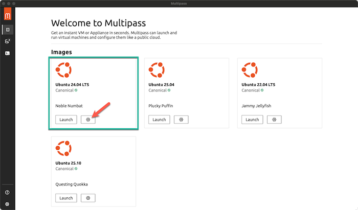
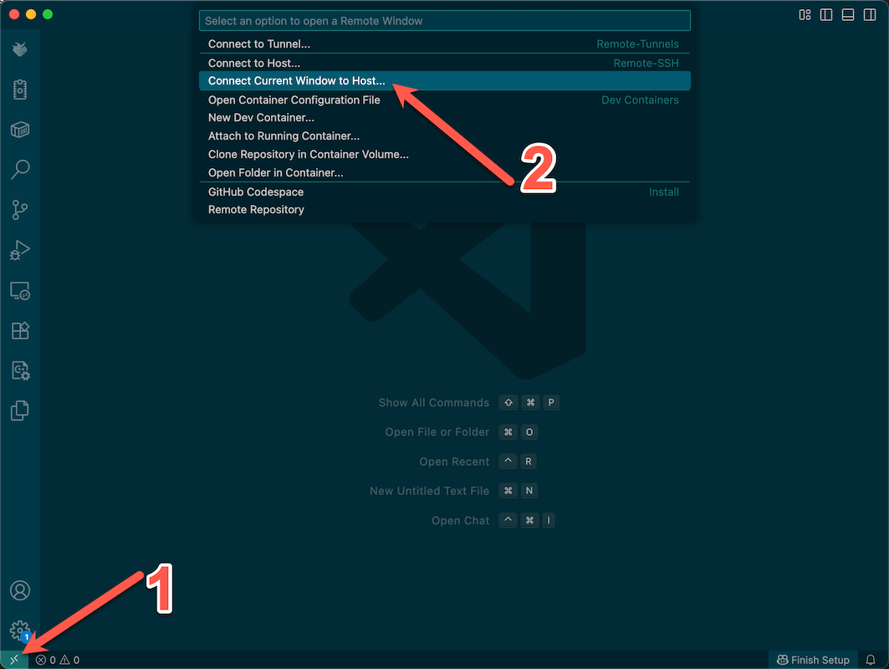

# Multipass Grading Environment Set-up Guide
## Overview
Multipass is a light-weight virtual machine orchistration tool that can be used to provision VMs using the hypervisor provided with your operating system. One Windows it utilizes Hyber-V and on MacOS and Linux it uses QEMU. It is made by Canonical and is specifically designed for deploying lightweight Ubuntu VMs. These lightweight Ubuntu VMs do not have a desktop or GUI interfaces associated with them, only termial access either directly from the Multipass application itself or over the network interface via SSH.  

In this Guide will configure a local Ubuntu instance with Multipass and then connect to it over SSH utilizing the Remote Development Extension in VSCode running on the host operating system. There are many ways to extend the functionality of these tools including setting up shared folders between the host operating system and the VMs running on Multipass, but those techniques will not be covered in this guide.

## Installing Multipass
The first step is to download and install Multipass for your host OS. Since Multipass utilizes the hypervisor provided with the host OS, it is important ensure the latest OS updates are installed before installing the latest version of Multipass. 

For my MacOS system I am running MacOS version 15.6.1 and Multipass version 1.16.1

### Download site
https://canonical.com/multipass/install

## Provision VM for grading
Multipass installs a GUI interface that can be utilized for basic VM provisioning and management.  Simply open the Multipass application from your Applications folder (or Start Menu). Selected the Ubuntu 24.04 LTS image and click the settings button (sprocket).



One the configuration screen, a good starting point is 2 CPU cores, 4GB RAM and 100GB storage space. You are welcome to adjust these to your own preferences. When you are done, click launch.


Alternatiely, the full Multipass functionality is available from the command-line. The following command can be utilized to provision the VM in a single step from the host OS terminal without the need to use the GUI.

```
multipass launch 24.04 --cpus 2 --disk 100G --memory 4G --name grader
```

### VM Control
The grader VM can be controlled either from the command-line or from the GUI. This allows you to start, stop and pause the grader VM.  To access this from the GUI, click the instances tab and select the grader VM.  This will allow you to Start, Stop, Suspend, or Delete the VM.  

Similiar functionality is also available from the command-line. The Multiplass documentation provides an excellent reference for this functionality.

[Manage Instances](https://documentation.ubuntu.com/multipass/en/latest/how-to-guides/manage-instances/)


## Configuration of Grading Environment
### Connecting to the shell
The grader terminal can be accessed from either the Multipass GUI or from the command-line.  To access it from the GUI, select the instances tab, then click on the name of the grader instance and it will allow you to connect to the grader terminal.  

Alternatively, you can use the following to access the terminal directly from the command-line.

```
multipass shell grader
```

Once you are connected to the grader terminal, you will be authenticated as the ***ubuntu*** user and will have password-less sudo privileges.

### Install latest Ubuntu Updates
``` 
sudo apt-get update
sudo apt-get upgrade
```

### Install Basic Development Tools
```
sudo apt-get install build-essential valgrind default-jdk python3-full zip wget python3-pip python3-keyring
```

### Install Python Modules for Classroom Sync
In Ubuntu 24.04, the decision has been made to force users to deploy their own python virtual environments to avoid potential conflicts with system modules.  However, in this case we are deploying an entire virtual Ubuntu instances for the specific purpose for running python. In addition, the modules installed below do not affect the system modules. For that reason, we can safely utilze the **--break-system-packages** flag to allow pip to manage these packages.

```
pip3 install --break-system-packages canvasapi keyring python-decouple
```

## Setup SSH Key-based authentication with GitHub.
### Generate Keys for Grader Environment
Generate an SSH keypair on the grading environment and then give it access to your GitHub account. The ssh-keygen tool will prompt for a password for the private key. It then generates a public and private key and stores them in the /home/ubuntu/.ssh folder. 
```
ssh-keygen
```

### Add public key to GitHub
Use the cat command to display the public key and then copy and paste the value into the SSH Keys section on your Github Account Settings page. The example below shows the public key file for my system. The output of the ssh-keygen command will show the the correct path for the public key file on yours.

```
cat /home/ubuntu/.ssh/id_ed25519.pub
```

Run a quick test to ensure you can successfully clone a private repository from your github account into the grading environment. Ensuring this is working correctly now will save a lot of headaches later.

### Use an Agent
To prevent getting prompted each time you try to use these keys, use the following commands to start an SSH agent and then add the key to this agent. These commands will need to be re-run each time you start up a new terminal session.

```
eval $(ssh-agent -s)
ssh-add ~/.ssh/id_ed25519
```

It is also possible to start up an SSH agent on the host OS system and add the keys to that instances. Then connect to the grading VM over ssh and pass that SSH agent transparently over the SSH tunnel. This process can be straightforward on MacOS and Linux host systems, but can be more challenging on Windows based hosts.

### Configure Git user metadata
```
git config --global user.name "Your Name"
git config --global user.email "username@u.boisestate.edu"     
git config --global pull.rebase false
```

## Configure the classroom sync tool
The current design of classroom sync only allows it to connect to a single classroom at a time. Multiple classrooms can be accomodated one of two ways.  The first is to simply have multiple copies of the classroom-sync repository such as cs121-classroom-sync and cs221-classroom-sync, each configured for its respective course.  The second is to create separate configuration files such as cs121-classroom-config.json and cs221-classroom-config.json, then modify each tool in the classroom sync suite to accept a config file on the command-line. 

### Clone the classroom-sync repository into the grading environment
```
git clone https://github.com/lhindman/classroom-sync
```
### Download student roster
Log into GitHub classroom and download the student roster. Save this file as classroom-roster.csv in the classroom-sync folder.

### Update classroom-config.json
Copy the provided classroom-config-example.json file to classroom-config.json, then edit classroom-config.json with the details for your course.
```
cp classroom-config-example.json classroom-config.json
```
The Canvas Course Name and Canvas Course Code can be found on the settings page for your Canvas course site. The example below is the config for my Fall 2025 section of CS253.

```
{
    "global":{
        "github-roster":"classroom-roster.csv",
        "github-org":"HindmanCourses",
        "canvas-course-name":"Fa25 - CS 253 - Software Development in C",
        "canvas-course-code":"CS253 4001 CS253 4002",
        "canvas-url":"https://boisestatecanvas.instructure.com/",
        "classroom-path":"/home/ubuntu/grading"
    }
}
```

### Enable Canvas API Access
The recommended ways to store the Canvas API token is to use the system keyring. Unfortunately on Ubuntu the OS's keyring manager requires the GNOME GUI which we are not running. For that reason, we will need to store the Canvas Token in a .env files in the classroom-sync folder. The *.gitignore* file excludes **.env** to prevent this file from accidentally being pushed to github. 

#### Generate Canvas Token
To create an Access Token in Canvas do the following:
- Go to Account, Settings, New Access Token with reason “To Synchronize Github Classrooms and Grades"

#### Store Canvas Token in file
Linux systems running the Gnome Keyring Manager, such as RedHat Enterprise Linux, do not support unlocking the keyring from the command line or over an ssh session. To work around this issue, the Canvas token can be stored in a text file called **.env** in the same directory as the sync scripts, and then read as an environment variable within the sync scripts.
```
touch .env
chmod 0600 .env
vim .env
CANVAS_TOKEN=<dev token from Canvas>
```

## VSCode Remote Development
The last step in this process is to install VSCode on the host OS and then use the Remote Development Extension to connect to the grader VM over SSH.
### Download and install VSCode
VSCode supports MacOS, Linux, and Windows. 
[VSCode Download](https://code.visualstudio.com/download)

### Generate SSH Key on host system
If you have an existing SSH key on your host system you can skip this step.  If not, you will need to generate a new public / private keypair for SSH on your host system using ssh-keygen. This process is varies based upon your OS, so use look up the appropriate technique.

### Add your public SSH key to the authorized_keys file on the grader VM
Use vim (or your favorite text editor of choice) to add the public SSH key from your host OS to the authorized_keys file on the VM.
```
vim ~/.ssh/authorized_keys
```

### Record the private IP address of the grader VM
The grader virtual machine will be assigned a private IP address in the 192.168.64.0/24 subnet which is only accessible from other VMs and the host OS.  the **ip addr* command will display the ipconfigration for the vm. From the output below you can see that the private IP for my grader VM is ***192.168.64.19***.
```
ubuntu@Grader:~$ ip addr
1: lo: <LOOPBACK,UP,LOWER_UP> mtu 65536 qdisc noqueue state UNKNOWN group default qlen 1000
    link/loopback 00:00:00:00:00:00 brd 00:00:00:00:00:00
    inet 127.0.0.1/8 scope host lo
       valid_lft forever preferred_lft forever
    inet6 ::1/128 scope host noprefixroute 
       valid_lft forever preferred_lft forever
2: enp0s1: <BROADCAST,MULTICAST,UP,LOWER_UP> mtu 1500 qdisc fq_codel state UP group default qlen 1000
    link/ether 52:54:00:05:9c:fb brd ff:ff:ff:ff:ff:ff
    inet 192.168.64.19/24 metric 100 brd 192.168.64.255 scope global dynamic enp0s1
       valid_lft 2008sec preferred_lft 2008sec
    inet6 fde4:763:c6c8:2aa0:5054:ff:fe05:9cfb/64 scope global dynamic mngtmpaddr noprefixroute 
       valid_lft 2591986sec preferred_lft 604786sec
    inet6 fe80::5054:ff:fe05:9cfb/64 scope link 
       valid_lft forever preferred_lft forever
```
### Remote Development with VSCode.
In VSCode, click the Extensions button and install the Remote Development Extension Pack. Once installed, click the connect button in the lower left corner of the VSCode window.  



From the Dropdown select "+ Add New SSH Host" then enter the following for the ssh connection command, substituting your own IP address recorded in the previous step.

```
ssh ubuntu@192.168.64.18 -A
```

When prompted save this to the ssh config file in your home directory. Once added it will prompt you to connect and then will ask you for your private SSH key password (if you set one) and then prompt you to accept the finger print of the VM. At that point you should be good to go! :)

VSCode provides some excellent guides and tutorials for remote development and are worth checking out.
[VSCode Remote Development Tutorials](https://code.visualstudio.com/docs/remote/remote-overview)

## That's All Folks!
At this point you're ready to begin using the tools in the classroom-sync suite
